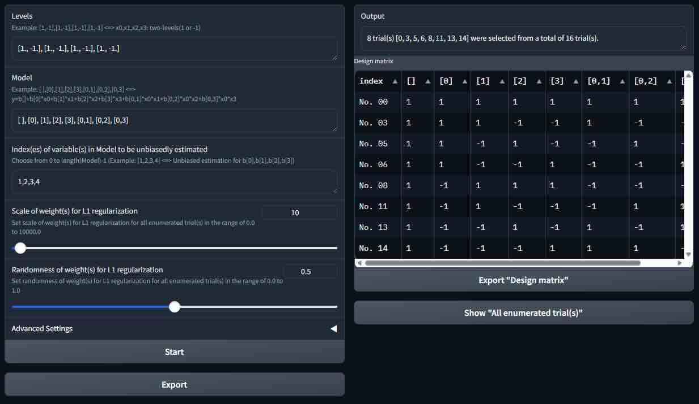

# Explasso

[English](README.en.md) &nbsp;&nbsp;&nbsp;&nbsp;&nbsp; [日本語](README.jp.md)

## 概要
実験計画を自動生成するためのPythonのプログラムです。スパースモデリングの手法を用いています。

## 使い方
- Pythonの実行環境がない場合
    - Windows の場合は、 "[explasso_gradio_win.7z](https://github.com/tanaken-basis/explasso/raw/master/explasso_gradio_win.7z)" をダウンロードして解凍し、"explasso_gradio.exe"をダブルクリックすると、実験計画を自動生成するWebアプリが起動します。起動するまで2～3分かかる場合があります。このWebアプリは、ローカルで動作します。
    - Mac (Apple silicon) の場合は、 "[explasso_gradio_mac.7z](https://github.com/tanaken-basis/explasso/raw/master/explasso_gradio_mac.7z)" をダウンロードして解凍し、"explasso_gradio"をダブルクリックすると、実験計画を自動生成するWebアプリが起動します。起動するまで2～3分かかる場合があります。このWebアプリは、ローカルで動作します。
- Pythonプログラムの使用
    - "explasso.py"をPythonで実行すると、実験計画を自動生成します。自動生成結果をCSVファイルとして保存します。
    - "explasso_gradio.py"をPythonで実行すると、GradioによるWebアプリが起動します。実験計画の自動生成のためのパラメータの調整、自動生成の計算の実行、計算結果のファイルへの出力などができます。このWebアプリは、ローカルで動作させることができます。
    - ノートブックのファイル"explasso.ipynb"にも、同様の動作をするプログラムを記述しています。

## Pythonプログラムを使用する場合の注意点
- このコードでは、最適化の計算のために、Pythonライブラリ CVXOPT を使用しています。CVXOPT のインストールについては、https://github.com/cvxopt/cvxopt を参照してください。
- Webアプリの作成には、Pythonライブラリ Gradio を使用しています。Gradio のインストールについては、https://github.com/gradio-app/gradio を参照してください。

## サンプルの実行結果

