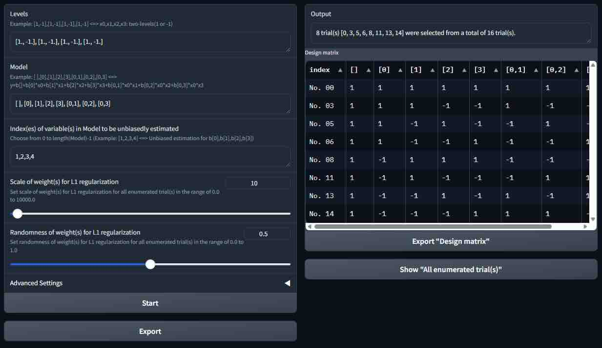

# Explasso

[English](README.en.md) &nbsp;&nbsp;&nbsp;&nbsp;&nbsp; [日本語](README.jp.md)

## 概要
実験計画を自動生成するためのPythonのプログラムです。スパースモデリングの手法を用いています。

## 使い方
- Pythonの実行環境がない場合
    - Windows の場合は、 "[explasso_gradio_win.7z](https://github.com/tanaken-basis/explasso/raw/master/explasso_gradio_win.7z)" をダウンロードして解凍し、"explasso_gradio.exe"をダブルクリックすると、実験計画を自動生成するWebアプリが起動します。起動するまで2～3分かかる場合があります。このWebアプリは、ローカルで動作します。
        - 「WindowsによってPCが保護されました」のような警告が出た場合は、「詳細情報」をクリックして、「実行」をクリックします。
    - Mac (Apple silicon) の場合は、 "[explasso_gradio_mac.7z](https://github.com/tanaken-basis/explasso/raw/master/explasso_gradio_mac.7z)" をダウンロードして解凍し、"explasso_gradio"をダブルクリックすると、実験計画を自動生成するWebアプリが起動します。起動するまで2～3分かかる場合があります。このWebアプリは、ローカルで動作します。
        - Macでアプリが実行できない場合は、ターミナルで`sudo spctl --master-disable`と入力してすべてのアプリを許可すると実行できるようになります。`sudo spctl --master-enable`と入力することで元の状態に戻せます。
- Pythonプログラムの使用
    - "explasso.py"をPythonで実行すると、実験計画を自動生成します。自動生成結果をCSVファイルとして保存します。
    - "explasso_gradio.py"をPythonで実行すると、GradioによるWebアプリが起動します。実験計画の自動生成のためのパラメータの調整、自動生成の計算の実行、計算結果のファイルへの出力などができます。このWebアプリは、ローカルで動作させることができます。
    - ノートブックのファイル"explasso.ipynb"にも、同様の動作をするプログラムを記述しています。

## Pythonプログラムを使用する場合の注意点
- このコードでは、最適化の計算のために、Pythonライブラリ CVXOPT を使用しています。CVXOPT のインストールについては、https://github.com/cvxopt/cvxopt を参照してください。
- Webアプリの作成には、Pythonライブラリ Gradio を使用しています。Gradio のインストールについては、https://github.com/gradio-app/gradio を参照してください。

## サンプルの実行結果

